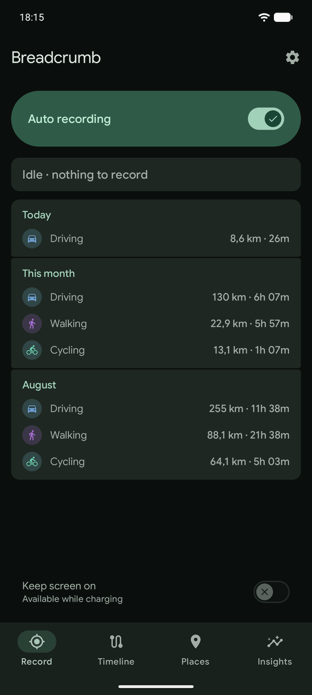
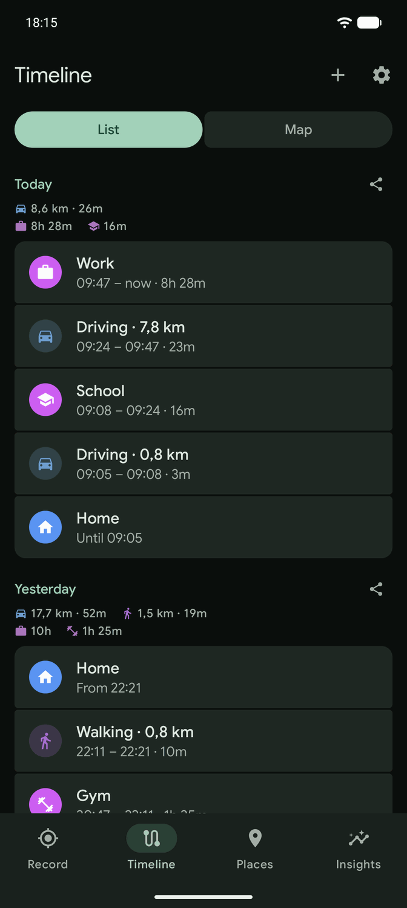
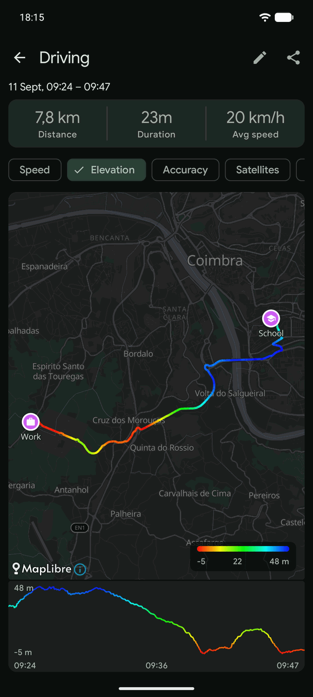
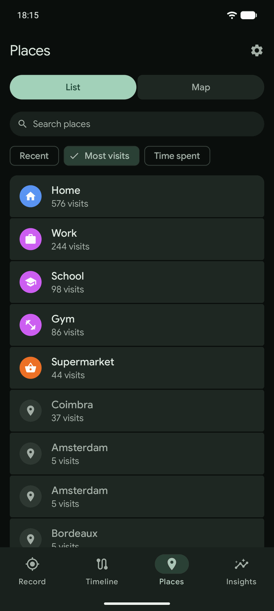
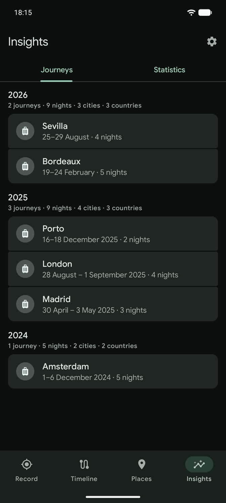
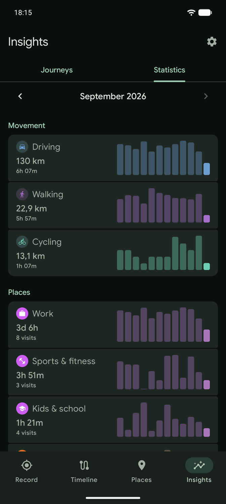

# Breadcrumb

An Android app that keeps a day-by-day timeline of where you have been — trips, the stays between
them, and the places you name — and fills it in by itself, recording in the background from your
detected activity: walking, running, cycling or driving. Arm it once and forget it: it records
while you move and pauses while you're still. Everything stays on your device — no account, no
server — with journeys away from home in Insights, trips you can enter by hand for what nothing
recorded, GPX import/export and a full backup.

## Try it (closed testing)

Breadcrumb is on Google Play in closed testing. Testers are admitted through a Google Group, so
all three steps are needed — and all of them with the same Google account you use on your phone:

1. [Join the testers group](https://groups.google.com/g/breadcrumbtesting)
2. [Opt in to the test](https://play.google.com/apps/testing/io.github.valeronm.breadcrumb)
3. [Install from Google Play](https://play.google.com/store/apps/details?id=io.github.valeronm.breadcrumb)

Step 2 can take a little while to take effect after joining the group; if the store page doesn't
offer the install yet, try again later.

## Screenshots

<p align="center">
  
  
  
</p>
<p align="center">
  
  
  
</p>

*Demo data — a synthetic history from `tools/generate_demo_history.py`, restored into the `demo`
build. No real history is ever shot.*

## Features

- Activity-aware recording — on-device activity recognition starts a trip when you start moving,
  switches trips when your activity changes (e.g. walking → driving), and pauses when you're
  stationary; a brief stop stitches back into the same trip rather than splitting it. Recognized:
  walking, running, cycling, driving and stationary, plus motion it can't name, which records as
  *Moving* — and a trip can be reclassified afterwards, including as modes recognition never
  reports on its own: taxi, boat, public transit and flight. Flip *Auto recording* on once and it
  keeps working with the screen off or the app closed, survives reboots and the system killing it,
  and runs GPS only while you are moving — a guard switches the receiver off when a "moving"
  detection never produces a position, and by default only what the satellites measured is kept.
  A journey you sit still through — a train, a taxi — can escape recognition entirely, so the app
  also notices you have set off by other means: see *Starting a trip* under How it works.
- Places — recurring stays cluster into places you name (home, work, the gym), each with a capture
  radius you can adjust and a category from a fixed vocabulary; categories the app suggests are
  learned from the ones you have already tagged. The Places tab shows them on a map and as a
  sortable list, each with its own visit history.
- Insights — journeys, meaning runs of nights spent away from a place you tagged Home, named after
  where the time actually went, with per-year totals of journeys, nights, cities and countries.
  While you are away, times read on the clock of the place they happened in, not the phone's.
- Fill in what wasn't recorded — enter a trip by hand from two pins and two times, from the
  Timeline's "+" or straight from a gap row, which opens the form already holding the ends it can
  speak for. Merge trips a short stop split, or split one that should have been two; both are
  undoable, and a hand-entered trip can be edited afterwards.
- A map of how it was recorded — a trip's track is colored per point by speed, elevation, accuracy,
  satellite count or signal strength, and drawn alongside the points the filter rejected, the stays
  detected along the way, and the named places claiming each end.
- GPX import & export — import `.gpx` files (via the picker, a share target, or opening a `.gpx`
  file); export a single track from its page, a whole day from the day header, or everything to a
  folder of `.gpx` files.
- Backup & restore — your whole history as one file: every kept trip with its points and the
  places, with restore offered on an empty timeline. A
  single trip needs no backup to come back: deletions, and trips the keep limits discard, wait in
  Recently deleted until they age out.
- App lock — an optional unlock on opening (fingerprint or device PIN), and a switch that blocks
  screenshots and hides the app in the recents switcher. Recording is never locked: trips keep
  being recorded whether or not the app is.

## How it works

- Activity Recognition Transition API (Google Play Services) detects when you start/stop walking,
  running, cycling, driving, or going still. A one-shot snapshot on arming starts recording
  immediately if you're already moving. Recognition describes your body rather than the journey —
  it will call you still aboard a moving train — so a second witness cross-checks it against
  measured ground speed before a "stationary" reading is allowed to end a trip. The same doubt
  covers starting — see *Starting a trip* below.
- A foreground service (`LocationRecordingService`) keeps recording while the app is in the
  background. A persistent notification is mandatory on modern Android — there is no truly
  invisible always-on location option. The service checks location permission before starting, so
  a revoked permission falls back to the in-app prompt instead of failing.
- Positioning uses the platform `GPS_PROVIDER` — there is no fused or network fallback, since a
  position the phone inferred can report a tight accuracy radius while being nowhere near the
  truth. GPS runs only while moving.
- Each trip is stored as one `Track` of `TrackPoint` rows in Room — the code keeps the name *track*
  for the stored path, which is why a hand-entered trip is a `Track` holding only its two ends.
  Related activities (walking ⇄ running) share one, and a stop shorter than the resume window
  stitches back into it instead of splitting. Those failing the configured keep-thresholds (e.g.
  too few points) are discarded automatically, including any left dangling by a crash. A track's
  distance and point counts live on its own row, so drawing the timeline never walks the points.
- Stays and places are derived from where consecutive trips begin and end. Named places persist and
  label the timeline; journeys are then read off the same derivation as runs of nights whose
  cluster is not one of your Home places.
- The map is MapLibre GL Native on a bundled Protomaps vector basemap, dark or light with the app's
  theme. The track is one line feature per run of same-colored fixes — deliberately not a
  `line-gradient`, because the banded ramp, the source's simplification tolerance and the round
  caps are one mechanism — and switching the metric rebuilds the source without moving the camera.
- `GpxExporter` / `GpxParser` write and read GPX; exports share via `FileProvider` or bulk-write to
  a folder you pick via the Storage Access Framework. `BackupExporter` / `BackupImporter` stream
  the whole history as one gzipped JSON file, which is also what the companion viewer in `web/`
  reads.

### Starting a trip

Activity recognition's departure report is the usual start, but a journey you sit still through —
a train, a taxi, a bus — can produce no report at all. Three more ways of noticing you have set
off run beside it, each switchable on the *Starting a trip* settings page. All three answer one
shared rule — the phone has left once a position sits further from where you stopped than both
positions' stated error can explain — and differ only in what feeds them, a trade of how soon a
trip is noticed against what it costs:

- Leaving where you stopped — a geofence around the last stop. Costs no battery, and can take
  several minutes to notice.
- Movement the phone senses — the hardware significant-motion sensor fires a short burst of
  coarse position checks. Costs nothing until the phone moves.
- Regular position checks — a standing coarse request through the whole idle stretch. Notices
  soonest, and is the only one that uses battery while you are going nowhere, so it is off by
  default.

A trip opened this way has no "stationary" report coming to end it, so it is closed by the second
witness instead: a standstill proven by measured ground speed.

## Permissions

Nothing is requested at launch, and there is no onboarding flow. Turning **Auto recording** on is
what asks Android, one requirement at a time, stopping wherever you stop:

1. Location, set to *"Allow all the time"* — what a trip's path is measured from, and it has to keep
   working with the app closed. This is **one** requirement, because in system settings it is one
   switch; Android just won't take the all-the-time question until plain location is granted, so it
   is asked in two goes. A disclosure precedes the second, after which Android takes over — from
   Android 11 it opens its own location page for the app rather than a dialog.
2. Physical activity — noticing you have set off is what starts a recording, and noticing you have
   stopped is what ends it.
3. Notifications (Android 13+) — how a running recording shows itself.
4. Ignore battery optimizations — Android stops background recording after a while without it.

All four are required to arm. The last two could technically be refused and still leave a recording
running, but both turn into failures the user only meets much later — a recorder killed in the
background, or one running invisibly — so recording waits for the lot rather than starting on terms
that quietly don't hold.

Whatever is left unmet is listed on the Record tab itself — one card, a row per requirement with its
reason and its own button, and no page behind it. That state is worked out from the permissions
themselves, so revoking one later brings the card back on its own; a permission Android refuses to
ask about again (two denials) offers a route to system settings rather than a button that does
nothing.

## Build

The build runs on JDK 21 automatically, whatever your system default JDK is: Gradle's daemon JVM
is pinned to Java 21 via `gradle/gradle-daemon-jvm.properties` (auto-provisioned if no JDK 21 is
installed). No `JAVA_HOME` override is needed.

```bash
./gradlew :app:assembleDebug   # build the debug APK
./gradlew :app:installDebug    # build + install on a connected device / emulator
```

The debug APK lands in `app/build/outputs/apk/debug/` and installs as
`io.github.valeronm.breadcrumb.debug` (alongside a release install, with a distinct
blueprint-grid launcher icon).

A fresh checkout needs a Protomaps hosted-API key for the basemap to load: add `protomapsApiKey=…`
to `local.properties` (gitignored). Without it the map tiles won't render.

The screenshots above come from a build type of their own: `./gradlew :app:installDemo` installs as
`io.github.valeronm.breadcrumb.demo`, alongside a release and a debug install rather than replacing
either, with the build badge and the developer tools switched off. Run
`python3 tools/generate_demo_history.py`, push what it writes to the device, and restore it from
the Timeline's empty state — every screen then has a history to show. The generated data is
gitignored: it has to end today to be worth shooting, so it is made per shoot rather than kept.

Unit tests cover the domain rules and the data layer, and reach further than plain JVM code through
Robolectric — the Room database, and the timeline's rows read back off the semantics tree:

```bash
./gradlew :app:testDebugUnitTest
```

Robolectric's native runtime ships no Linux arm64 build, so on an arm64 machine the Robolectric
tests need `-PqemuJdk` (see `CLAUDE.md`); everywhere else they just run.

## Tech stack

Kotlin · Jetpack Compose (Material 3) · Room · Play Services Location (Activity Recognition;
positions come from the platform GPS provider) · MapLibre GL Native on a Protomaps vector
basemap · AGP 9.3.1 / Gradle 9.6.1 · single-module.

## Testing activity switching

Activity recognition needs real movement (or a route played through an emulator's extended
controls → Location → Routes) to fire transitions. While stationary the app shows
*"Idle · nothing to record"*; start walking or driving and a trip begins automatically. You
can also import a `.gpx` file to populate trips, places, and the map without moving.

## Notes & limitations

- Privacy: your history is local. Nothing is uploaded; there's no analytics or account. The network
  carries map data — Protomaps tiles, glyphs and sprites — plus one thing you can switch off: the
  add-trip form's online place search, which sends the words you typed to Photon and, where the
  form has a pin to bias by, that pin. Place names otherwise come from a gazetteer bundled in the
  APK, so naming a journey needs no network at all.
- Play Services dependency: activity recognition relies on Google Play Services, so this isn't a
  fully FOSS / F-Droid-friendly build.
- Single device / single user: no multi-device sync (server upload to e.g. Dawarich/OwnTracks is a
  possible future addition). `web/` renders a backup file in the browser instead — the same data,
  deriving the same timeline.

## Third-party data

- Place names come from [GeoNames](https://www.geonames.org/) `cities1000`, packed by
  `tools/pack_cities.py` into `app/src/main/assets/cities.bin` and shipped in the APK — CC BY 4.0.
- The basemap is [Protomaps](https://protomaps.com/) vector tiles built from OpenStreetMap data,
  fetched from their hosted API — © OpenStreetMap contributors, ODbL.
- The optional online place search queries [Photon](https://photon.komoot.io/), also OpenStreetMap
  data — © OpenStreetMap contributors, ODbL.

The app repeats these credits where a user can see them, in Settings and beside the search results,
which is what the licences ask; `NOTICE` carries the same list for anyone redistributing the repo.
